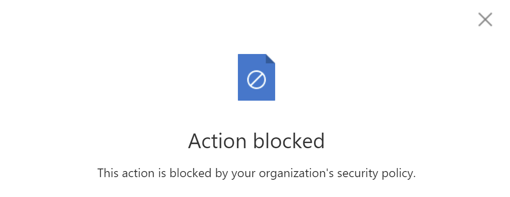

# Microsoft 365 Web Apps Copy Unlocker

  

## Description
This plugin is designed to remove the restrictions that prevent users from performing copy operations in Microsoft 365 web applications, such as Word, PowerPoint, Excel, and others.
## Installation
To install this plugin, you need to use the Chrome browser's built-in extension loader for unpackaged extensions. Here's how to do it:

1. **Download or clone the Plugin Repository:** Download and extract the zip file or clone the repository of the plugin to a specific location on your computer.

2. **Open the Extension Management page in Chrome:**

    - Either navigate to `chrome://extensions` in the address bar.
   
3. **Switch On Developer Mode:** At the top right of the Extension Management page, activate the `Developer mode` toggle.

4. **Load the Unpacked Extension:**

    - Click the `Load unpacked` button that just appeared.
    - An explorer window will open. Navigate to where you saved the plugin and select the folder.

If the plugin folder is structured correctly, Chrome will load the extension, and you will see your extension listed with an `ID`, which is the unique extension ID.

**Remember to turn off Developer Mode after the extension is loaded to prevent any unnecessary changes to your browser settings.**

Official google documentation on how to load an unpacked extension:
[https://developer.chrome.com/docs/extensions/get-started/tutorial/hello-world
](https://developer.chrome.com/docs/extensions/get-started/tutorial/hello-world)

## Usage
1. Click the Extensions icon on the Chrome browser toolbar. It looks like a puzzle piece.
2. Find 'Microsoft 365 Web Apps Copy Unblocker' in the dropdown list and click on it.
3. In the plugin popup, simply click the 'Start' button. This will activate the plugin and remove the copy restrictions in Microsoft 365 web applications.
4. It works on one page at a time. If you navigate to another page, you will need to click the 'Start' button again.

  

## ⚠️ Disclaimer ⚠️
While this plugin facilitates copy operations from Microsoft 365 web applications, it's important to clarify that these clipboard restrictions might be in place due to company policies on data protection and privacy.

♥️ **Proceed with caution. Misuse can lead to violations of company policies or even the law.** ♥️

Before using this plugin, make sure that you:
- Have thoroughly read and understood its purpose and functioning.
- Have considered the potential consequences and risks.
- Are perfectly clear about what you're doing.
- Have all necessary permissions and authorizations.